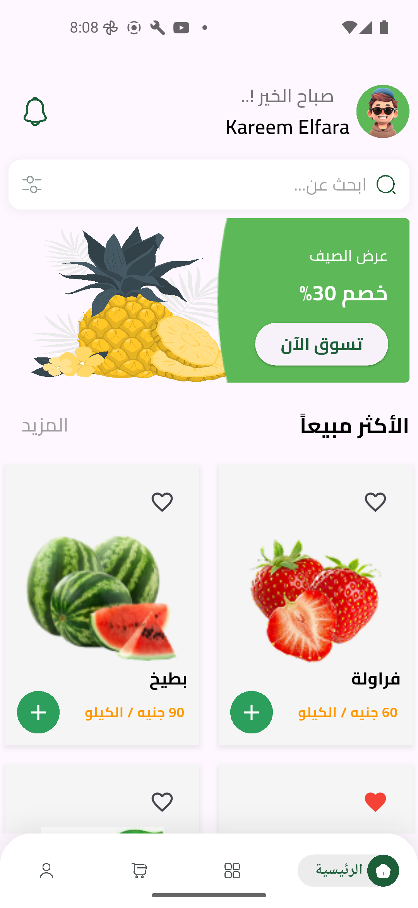
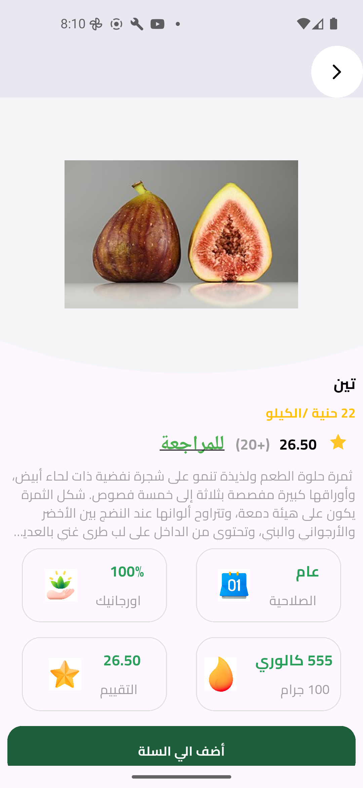
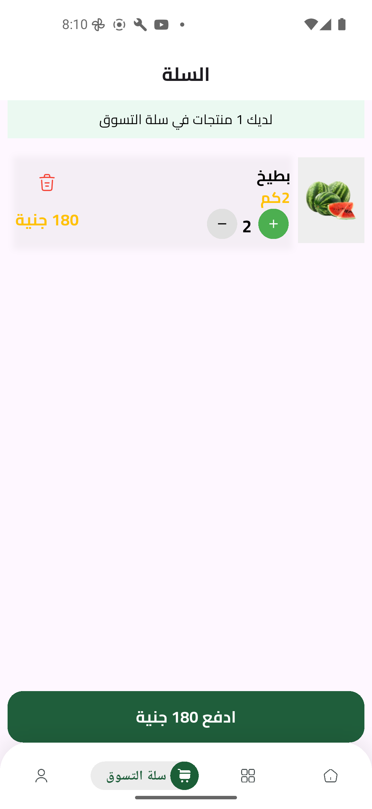

# 🍎 Fruit Hub - Flutter E-Commerce App

**Fruit Hub** is a Flutter-based e-commerce application designed for seamless online shopping of fresh fruits. It offers a user-friendly interface, real-time updates, and a smooth shopping experience.

---
## 🍓 About
Fruit Hub is a cross-platform mobile application built with Flutter that connects fruit lovers with the freshest produce available. The app provides a seamless shopping experience with intuitive design and smooth performance across both iOS and Android platforms.

## 🛠 Features

* **Product Catalog:** Browse a variety of fresh fruits with detailed information.
* **Search & Filter:** Easily find products using search functionality and filters.
* **Shopping Cart:** Add items to your cart and proceed to checkout.
* **User Authentication:** Secure login and registration features.
* **Order Management:** View and manage your orders.
* **Responsive Design:** Optimized for both Android and iOS platforms.

---

## 🖥 Tech Stack

* **Frontend:** Flutter
* **Backend:** Firebase (for authentication and real-time database) & supabase .
* **State Management:** Provider / Riverpod
* **Push Notifications:** Firebase Cloud Messaging (FCM)

---

## 🚀 Getting Started

### Prerequisites

* Flutter SDK (>=3.0.0)
* Dart SDK
* Firebase project setup
* supabase project setup

### Installation

1. Clone the repository:

   ```bash
   git clone https://github.com/kareemAlfara/-E-Commerce.git
   ```

2. Navigate to the project directory:

   ```bash
   cd -E-Commerce
   ```

3. Install dependencies:

   ```bash
   flutter pub get
   ```

4. Set up Firebase:

   * Create a Firebase project.
   * Add your Android and iOS app to the Firebase project.
   * Download the `google-services.json` (for Android) and `GoogleService-Info.plist` (for iOS).
   * Place these files in the appropriate directories:

     * `android/app/` for `google-services.json`
     * `ios/Runner/` for `GoogleService-Info.plist`

5. Configure Firebase Cloud Messaging (FCM) for push notifications (if implemented).

6. Run the application:

   ```bash
   flutter run
   ```

---

## 📦 Folder Structure

```
lib/
 ├─ features/
 │   ├─ auth/           # Authentication screens and logic
 │   ├─ cart/           # Cart functionality
 │   ├─ home/           # Home screen, product listings
 │   └─ orders/         # Order management
 ├─ models/             # Data models
 ├─ providers/          # State management providers
 ├─ services/           # Firebase services and utilities
 ├─ utils/              # Utility functions and constants
 └─ main.dart           # Entry point of the application
```

---

## 📱 Screenshots


*Browse a variety of fresh fruits.*


*View detailed information about a product.*


*Manage items in your shopping cart.*

---

## 🤝 Contribution

Contributions are welcome! Please fork the repository, create a new branch, and submit a pull request with your proposed changes.

---

## 📄 License

This project is licensed under the MIT License.

**Developer**: Kareem Alfara  
**GitHub**: [@kareemAlfara](https://github.com/kareemAlfara)  
**Email**: [kareemelfara@gmail.com]

### Support
For technical support or questions:
- Create an issue on [GitHub Issues](https://github.com/kareemAlfara/-E-Commerce/issues)
- Email support: [Your Support Email]

---

## 🙏 Acknowledgments

- Flutter team for the amazing framework
- [Flutter community](https://flutter.dev/community) for packages and support
- Material Design for UI/UX guidelines
- All contributors and testers

---

**Built with 💙 using Flutter**

*A few resources to get you started if this is your first Flutter project:*
- [Lab: Write your first Flutter app](https://docs.flutter.dev/get-started/codelab)
- [Cookbook: Useful Flutter samples](https://docs.flutter.dev/cookbook)
- [Online documentation](https://docs.flutter.dev/) - tutorials, samples, guidance on mobile development, and a full API reference


